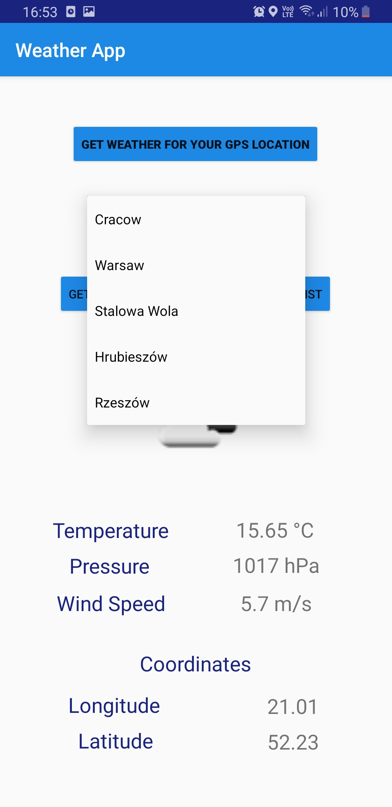
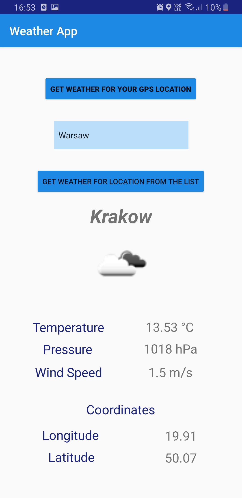

# WeatherApp
Android weather App that utilizes user's location using GPS and provides him with current weather conditions as well as with coordinates for his location.\
This App uses data from OpenWeatherMap API.\

User can choose from preset localizations avaliable in spinner.

This is the spinner view.

GPS localization is also avaliable.

